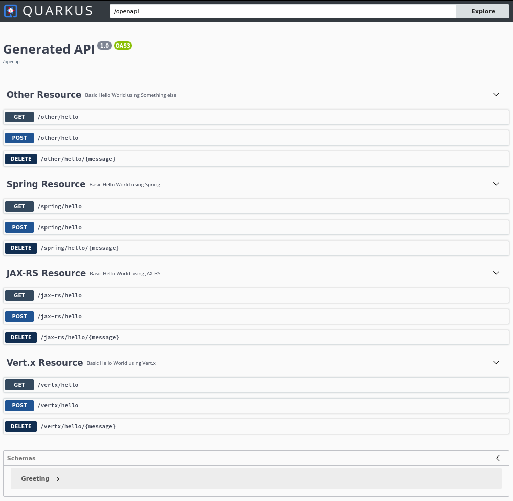

# Openapi example

This example show how you can use [MicroProfile OpenAPI](https://github.com/eclipse/microprofile-open-api) on [Quarkus](https://quarkus.io/) 
with [JAX-RS](https://resteasy.github.io/), [Spring Web](https://quarkus.io/guides/spring-web), [Vert.x Routes](https://quarkus.io/guides/reactive-routes) or all 3 !


We also show how to use MicroProfile config to configure:

* Header information (rather than using Annotations in a `Application` class).
* Changing the default (3.0.3) OpenAPI version.
* Auto-generate operationId from the method.

Also see:

* https://quarkus.io/guides/rest-json
* https://quarkus.io/guides/openapi-swaggerui
* https://quarkus.io/guides/spring-web
* https://quarkus.io/guides/reactive-routes
* https://quarkus.io/guides/rest-data-panache



## Running the application in dev mode

This project uses Quarkus, the Supersonic Subatomic Java Framework.

If you want to learn more about Quarkus, please visit its website: https://quarkus.io/ .

You can run your application in dev mode that enables live coding using:
```
./mvnw quarkus:dev
```

## Packaging and running the application

The application can be packaged using `./mvnw package`.
It produces the `openapi-example-1.0.0-SNAPSHOT-runner.jar` file in the `/target` directory.
Be aware that it’s not an _über-jar_ as the dependencies are copied into the `target/lib` directory.

The application is now runnable using `java -jar target/openapi-example-1.0.0-SNAPSHOT-runner.jar`.

## Creating a native executable

You can create a native executable using: `./mvnw package -Pnative`.

Or, if you don't have GraalVM installed, you can run the native executable build in a container using: `./mvnw package -Pnative -Dquarkus.native.container-build=true`.

You can then execute your native executable with: `./target/openapi-example-1.0.0-SNAPSHOT-runner`

If you want to learn more about building native executables, please consult https://quarkus.io/guides/building-native-image.